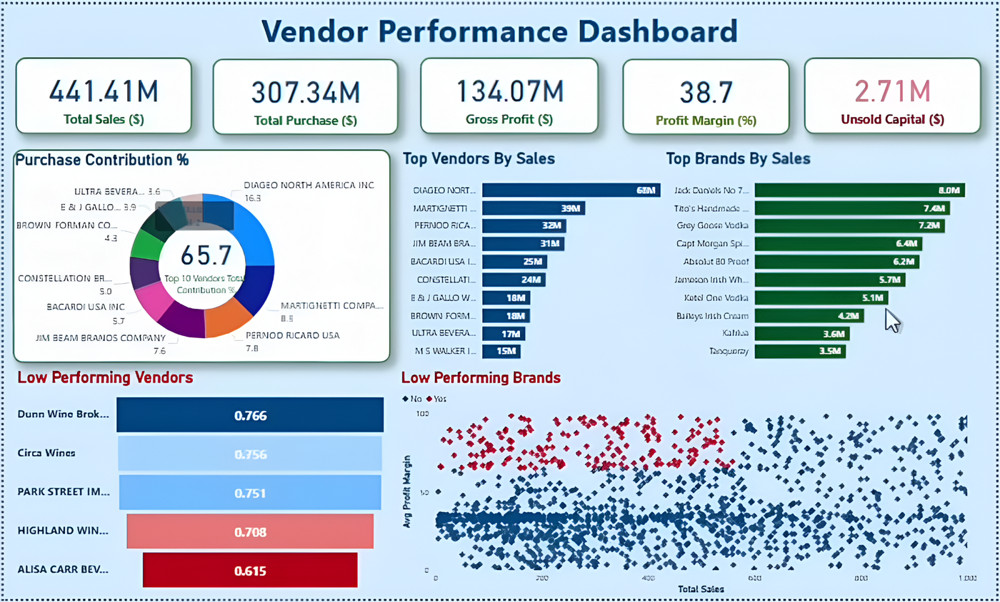
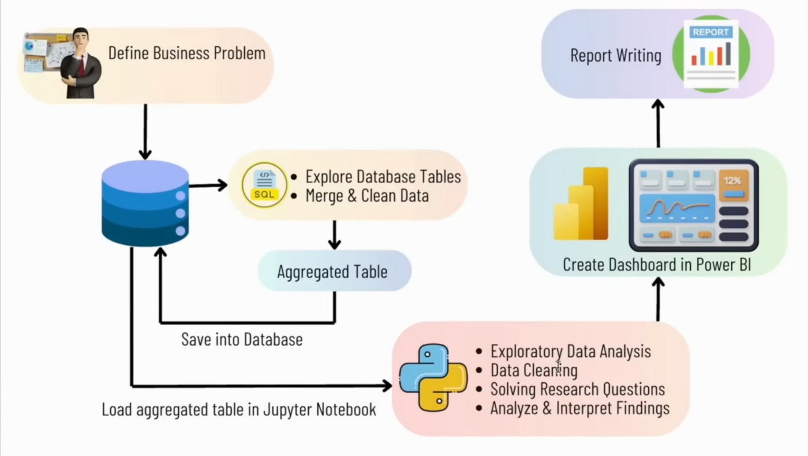
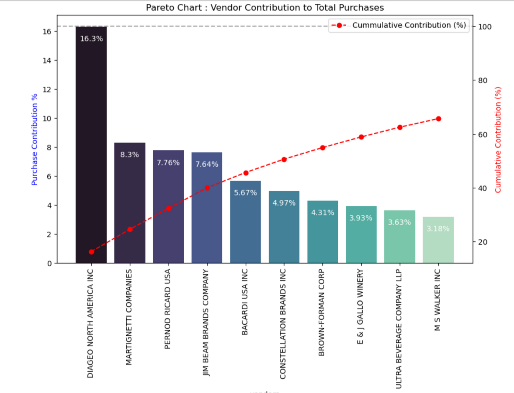
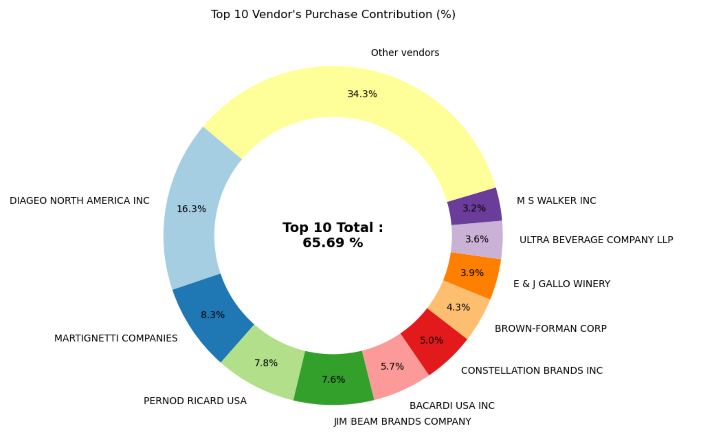
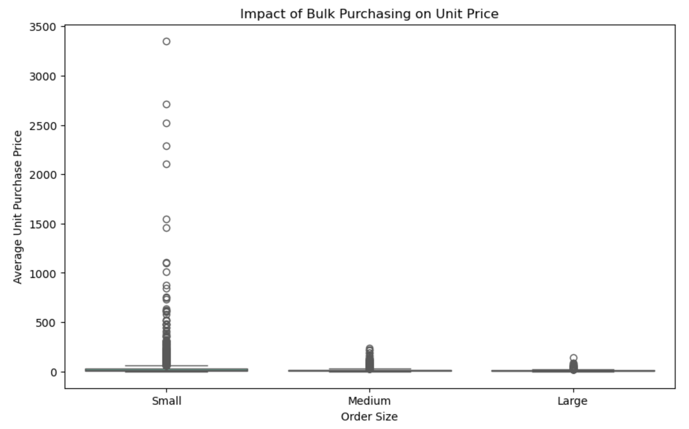
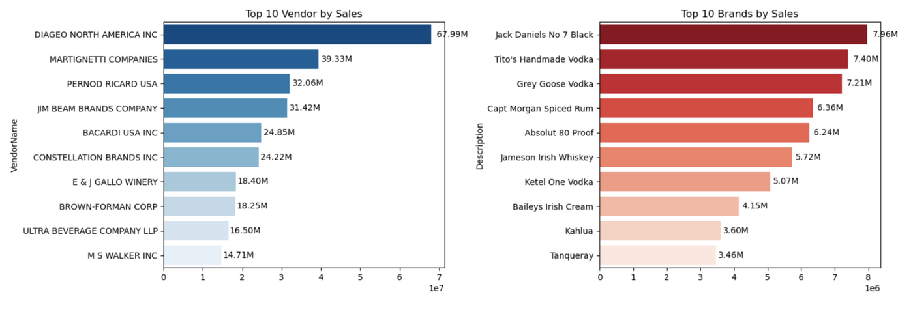

<div align="center">

# 📊 Vendor Performance Analysis

### Vendor Performance Analysis Using Python, SQL & Statistical Techniques

*Turning raw purchase, sales, and inventory data into vendor strategy decisions*


</div>

An end-to-end data analytics project that integrates purchase, sales, pricing, and freight data into a consolidated vendor summary table, then applies exploratory data analysis, statistical hypothesis testing, and Power BI visualization to uncover actionable procurement and profitability insights.

<p align="center">
  
  <br>
  <em>Interactive Power BI dashboard — Total Sales, Total Purchase, Gross Profit, Profit Margin & Unsold Capital at a glance</em>
</p>

---

## 📌 Table of Contents

- [Overview](#overview)
- [Business Problem](#business-problem)
- [Project Objectives](#project-objectives)
- [Tools & Technologies](#tools--technologies)
- [Project Architecture / Pipeline](#project-architecture--pipeline)
- [Repository Structure](#repository-structure)
- [Data Description](#data-description)
- [Feature Engineering](#feature-engineering)
- [Exploratory Data Analysis](#exploratory-data-analysis)
- [Statistical Analysis](#statistical-analysis)
- [Power BI Dashboard](#power-bi-dashboard)
- [Key Findings](#key-findings)
- [Recommendations](#recommendations)
- [How to Run This Project](#how-to-run-this-project)
- [Author](#author)

---

## Overview

Retail and wholesale businesses depend on a healthy balance between inventory levels, procurement cost, and sales performance to stay profitable. This project analyzes vendor and brand performance to surface where that balance is breaking down — and where it can be improved.

The workflow ingests raw CSV data into a SQLite database, integrates it with SQL into a single **Vendor Sales Summary** table, engineers key business metrics, performs EDA and hypothesis testing in Python, and finally visualizes the results in an interactive Power BI dashboard.

## Business Problem

Inefficient inventory management, over-dependence on a small number of vendors, underperforming products, and ineffective pricing strategies can quietly erode cash flow and profitability. This project uses data to answer a simple question: **where are the biggest opportunities to improve vendor and inventory performance?**

## Project Objectives

1. Identify underperforming brands that need promotional or pricing adjustments.
2. Determine the top vendors contributing to total sales, purchases, and gross profit.
3. Analyze the impact of bulk purchasing on unit costs and potential savings.
4. Evaluate inventory turnover to flag slow-moving products and reduce holding costs.
5. Measure vendor dependency and the risk of relying on a few suppliers.
6. Statistically compare profitability between high- and low-performing vendors.
7. Deliver actionable recommendations for procurement, pricing, and inventory strategy.

## Tools & Technologies

| Category | Tools |
|---|---|
| Language | Python |
| Database | SQL (SQLite) |
| Data Handling | Pandas, NumPy |
| Visualization (Python) | Matplotlib, Seaborn |
| Statistics | SciPy |
| Development | Jupyter Notebook |
| BI / Dashboarding | Power BI |

## Project Architecture / Pipeline

```
Raw CSV Files
     │
     ▼
Data Ingestion (Python) ──► SQLite Database
     │
     ▼
SQL Data Integration (vendor summary query)
     │
     ▼
Data Cleaning
     │
     ▼
Feature Engineering (Gross Profit, Profit Margin, Stock Turnover, Sales-to-Purchase Ratio)
     │
     ▼
Vendor Sales Summary Table
     │
     ▼
Exploratory Data Analysis (EDA)
     │
     ▼
Statistical Analysis (Confidence Intervals, Hypothesis Testing)
     │
     ▼
Power BI Dashboard
     │
     ▼
Business Insights & Recommendations
```

<p align="center">
  
  <br>
  <em>End-to-end workflow: from raw CSVs to business recommendations</em>
</p>

## Repository Structure

```
├── ingestion_db.py                     # Loads raw CSVs into SQLite database
├── get_vendor_summary.py               # Builds, cleans & ingests the Vendor Sales Summary table
├── Exploratory_Data_Analysis.ipynb     # Initial DB/table exploration
├── Vendor_Performance_Analysis.ipynb   # Full EDA, feature engineering & statistical analysis
├── Data_Analysis_Report.pdf            # Full written analysis report
├── POWER_BI_DASHBOARD_REPORT.pdf       # Power BI dashboard documentation
├── Images/                             # Images used in this README
├── logs/                               # Runtime logs for ingestion & summary scripts
└── README.md
```

## Data Description

The analysis integrates four relational tables:

| Table | Description |
|---|---|
| **Purchases** | Procurement transactions — date, vendor, brand, quantity, purchase price, total amount |
| **Purchase Prices** | Vendor–brand pricing (purchase price & actual price); each Vendor–Brand pair is unique |
| **Vendor Invoice** | Invoice-level data including **Freight Cost** per vendor, keyed by Vendor + PO Number |
| **Sales** | Actual sales transactions — brand, quantity sold, price, revenue, excise tax |

These are joined via SQL (see `get_vendor_summary.py`) into a single **Vendor Sales Summary** table combining purchase quantities/dollars, sales quantities/dollars, actual & purchase prices, and freight cost per vendor and brand.

## Feature Engineering

| Feature | Formula | Purpose |
|---|---|---|
| Gross Profit | Total Sales − Total Purchase | Measures profit earned |
| Profit Margin (%) | (Gross Profit / Total Sales) × 100 | Measures profitability |
| Stock Turnover | Sales Quantity / Purchase Quantity | Evaluates inventory efficiency |
| Sales-to-Purchase Ratio | Sales Dollars / Purchase Dollars | Compares sales against procurement cost |
| Unsold Capital | (Purchase Qty − Sales Qty) × Purchase Price | Capital tied up in unsold inventory |

## Exploratory Data Analysis

- **Negative/zero values:** Gross Profit as low as **-52,002.78**; some brands show zero sales (never-sold, slow-moving stock); Profit Margin can be **-∞** where revenue is zero.
- **Outliers:** Purchase/Actual Price maxima ($5,681 / $7,499) far exceed the mean (~$24–36), pointing to premium products; Freight Cost ranges from $0.09 to **$257,032**.
- **Data filtering:** Records with Gross Profit ≤ 0, Profit Margin ≤ 0, or zero Total Sales Quantity were excluded to focus on reliable, profitable transactions.
- **Correlation highlights:**
  - Total Purchase Quantity vs. Total Sales Quantity: **strong positive (0.999)**
  - Purchase Price vs. Sales/Profit: weak (~-0.01 to -0.02) — price alone doesn't drive revenue
  - Profit Margin vs. Total Sales Price: negative (-0.179) — higher prices can compress margins
  - Stock Turnover vs. Profitability: weak negative — faster turnover ≠ higher profit

<p align="center">
  
  <br>
  <em>Correlation heatmap across all engineered and raw KPI columns</em>
</p>

## Statistical Analysis

**Hypothesis Test — Profit Margin: Top vs. Low Performing Vendors**

- H₀: No significant difference in mean profit margins between top and low performing vendors
- H₁: Mean profit margins are significantly different
- **T-statistic:** -17.67, **p-value:** 0.0000 → **Reject H₀**

| Group | 95% CI | Mean |
|---|---|---|
| Top Vendors | (30.74, 31.61) | 31.18% |
| Low Vendors | (40.50, 42.64) | 41.57% |

Low-performing vendors maintain **higher margins but lower sales volume**, suggesting pricing power isn't translating into market reach.

## Power BI Dashboard

An interactive dashboard was built on the Vendor Sales Summary dataset with the following KPI cards and visuals:

**KPIs:** Total Sales ($441.41M) · Total Purchase ($307.34M) · Gross Profit ($134.07M) · Profit Margin (38.7%) · Unsold Capital ($2.71M)

**Visuals:**
- Purchase Contribution % (donut chart) — top 10 vendors vs. others
- Top Vendors by Sales (bar chart)
- Top Brands by Sales (bar chart)
- Low Performing Vendors (bar chart)
- Low Performing Brands (scatter plot — sales vs. profit margin)

**Interactive filters/slicers:** Vendor Name, Brand, Product Volume, Purchase Price, Sales Amount.

## Key Findings

<table>
<tr>
<td width="50%">

**1. Vendor Concentration Risk**

The **top 10 vendors contribute 65.69%** of total purchases, leaving the business exposed to supply chain risk from vendor concentration.



</td>
<td width="50%">

**2. Pricing Opportunity in Low-Sales Brands**

**198 brands** show low sales but high profit margins — strong candidates for targeted promotions or pricing adjustments.



</td>
</tr>
</table>

<p align="center">
  
  <br>
  <em>Diageo North America Inc leads vendor sales at ~$68M, followed by Martignetti Companies and Pernod Ricard USA</em>
</p>

3. **Bulk purchasing pays off:** unit price drops from **$39.07 (small orders)** to **$10.78 (large orders)**, a ~72% reduction.
4. **$2.71M in unsold capital** is tied up in slow-moving inventory, increasing holding costs and reducing cash flow.
5. **Diageo North America Inc**, **Tito's Handmade Vodka**, and **Jack Daniels No. 7 Black** lead vendor and brand sales respectively.
6. Statistically significant profit margin gap between top and low performing vendors (p < 0.0001) — low performers are priced well but under-distributed.

## Recommendations

- Re-evaluate pricing for low-sales/high-margin brands to boost volume without hurting profitability.
- Diversify vendor partnerships to reduce dependency risk.
- Leverage bulk purchasing to lower unit costs while managing inventory carefully.
- Address slow-moving inventory via adjusted purchase quantities, clearance sales, or revised storage strategy.
- Strengthen marketing and distribution for low-performing but high-margin vendors.

## How to Run This Project

1. **Set up the database**
   ```bash
   python ingestion_db.py
   ```
   Loads all CSV files from `data/` into a local SQLite database (`inventory.db`).

2. **Build the Vendor Sales Summary table**
   ```bash
   python get_vendor_summary.py
   ```
   Joins purchases, purchase prices, vendor invoices, and sales; cleans the data; engineers KPI columns; and writes the result back into `inventory.db`.

3. **Explore the data**
   Open `Exploratory_Data_Analysis.ipynb` to inspect raw tables, or `Vendor_Performance_Analysis.ipynb` for the full EDA, feature engineering, and statistical testing.

4. **View the dashboard**
   Open the Power BI `.pbix` file (or refer to `POWER_BI_DASHBOARD_REPORT.pdf`) connected to the `vendor_sales_summary` table for the interactive dashboard.

> **Requirements:** Python 3.x, `pandas`, `numpy`, `matplotlib`, `seaborn`, `scipy`, `sqlalchemy`, `sqlite3`, Jupyter Notebook, Power BI Desktop.

## Author

<div align="center">

**Aman Raj**
Data Analytics Project · 29 June – 6 July

*Built with Python, SQL, and Power BI*

⭐ If you found this project useful, consider giving it a star!

</div>
